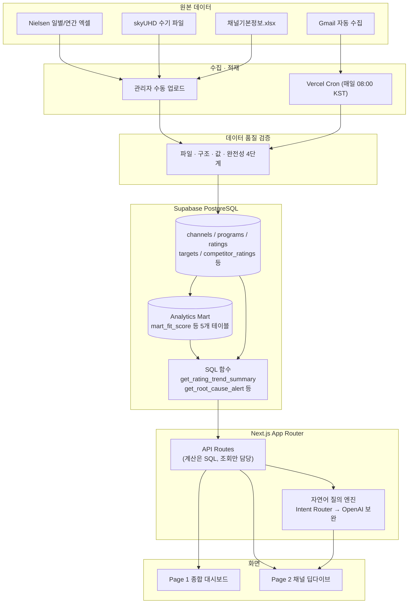
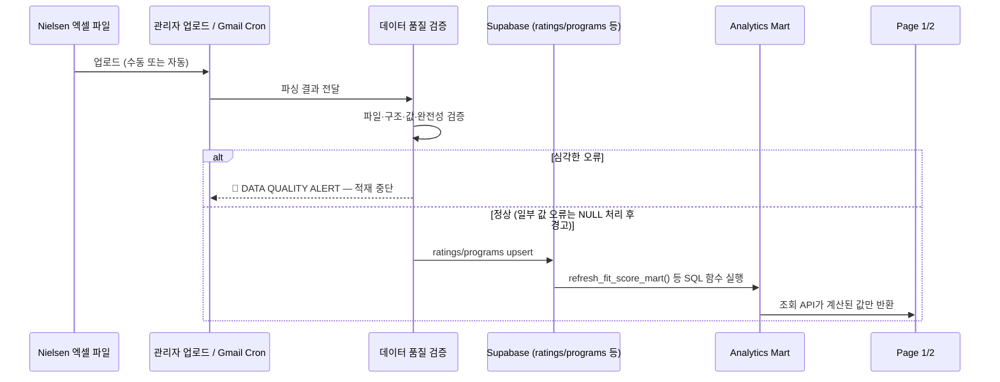

# 📺 KT ENA 편성 AI Agent

**Nielsen 시청률 데이터를 자동으로 모으고 분석해서, 편성 PD의 판단을 돕는 데이터 기반 편성 비서**

[](https://kt-ena-programming-agent.vercel.app)
[](https://nextjs.org/)
[](https://supabase.com/)
[](https://www.typescriptlang.org/)

**🔗 운영 서비스**: https://kt-ena-programming-agent.vercel.app
**📄 기획 문서**: [PRD.md](./PRD.md) · [prd_lite.md](./prd_lite.md) · [SCHEMA.md](./SCHEMA.md) · [DATA_DICTIONARY.md](./DATA_DICTIONARY.md)

---

## 목차

- [이 프로젝트는 무엇인가요?](#이-프로젝트는-무엇인가요)
- [핵심 기능](#핵심-기능)
- [화면 구조](#화면-구조)
- [아키텍처](#아키텍처)
- [기술 스택](#기술-스택)
- [폴더 구조](#폴더-구조)
- [로컬에서 실행하기](#로컬에서-실행하기)
- [배포](#배포)
- [데이터 파이프라인](#데이터-파이프라인)
- [개발 현황](#개발-현황)
- [알려진 한계](#알려진-한계)

---

## 이 프로젝트는 무엇인가요?

매일 반복되는 **Nielsen 시청률 데이터 수집·정리·계산·비교** 작업에는 많은 시간이 들고, 경쟁환경·타깃까지
종합적으로 분석해 실제 편성 의사결정으로 연결하기까지는 더 오랜 시간이 걸립니다.

이 프로젝트는 그 과정을 자동화합니다.

> 데이터를 단순히 보여주는 대시보드가 아니라 —
> **데이터를 구조화 → 지표를 계산 → 근거와 함께 편성 판단(KEEP / MOVE / REPLACE / STRENGTHEN / TEST)까지 제안**하는
> 다채널 오디언스 & 편성 인텔리전스 AI 에이전트입니다.

- **누가 쓰나요?** KT ENA 채널의 편성 PD, 관리자(업로드·설정 담당) 2명
- **분석 대상 채널**: ENA · ENA Drama · ENA Play · ENA Story · OLIFE · ONCE (전체 분석) + skyUHD (시청률만 별도 관리)

---

## 핵심 기능

| 기능 | 설명 |
|---|---|
| 📊 **Page 1 — 종합 대시보드** | 7개 채널의 오늘 성과를 한눈에 스캐닝. ENA 채널 최우선 하이라이트, Original 콘텐츠 리포트, 채널별 인사이트·킬러 콘텐츠, 🟢/🟡/🔴 빠른 요약 |
| 🔍 **Page 2 — 채널별 딥다이브** | 채널 선택 시 **8대 질문**(WHAT HAPPENED? · WHY? · WHO IS WATCHING? · HOW DEEPLY? · COMPARED WITH? · CONTENT FITS? · OPPORTUNITY? · WHAT TO SCHEDULE?)으로 구조화된 상세 분석 |
| 💬 **자연어 질의응답** | 규칙 기반 Intent Router가 1차로 응답하고, 낯선 표현은 OpenAI(gpt-4o-mini)가 보완 — 계산은 항상 검증된 SQL 함수만 사용 |
| 🎯 **Fit Score 편성 추천** | Target Performance(30%) + Target Affinity(20%) + Audience Engagement(15%) + Slot Performance(15%) + Competitive Opportunity(10%) + Audience Flow(10%) 가중합으로 프로그램별 적합도 산출, 근거(Evidence)·신뢰도(Confidence)와 함께 KEEP/MOVE/REPLACE/STRENGTHEN/TEST 제안 |
| 📈 **기간별 비교** | DoD / WoW / MoM / QoQ / YoY / YTD 자동 계산, 목표 시청률 대비 달성률·Gap |
| ⚠️ **원인 추적 · 기회 탐지** | 3일 연속 유의미한 하락 감지(원인 추적), 자사 강세 + 경쟁채널 약세 동시 관측(기회 탐지) — 상관관계를 인과관계로 단정하지 않음 |
| 📥 **관리자 업로드** | Channel/Competitor Master(엑셀 1장), Nielsen 일별/연간 파일, skyUHD 파일 업로드 → 자동 파싱·검증·적재 |
| 📧 **Nielsen 메일 자동 수집** | Gmail API로 매일 오전 첨부파일 자동 수집(Vercel Cron) — 관리자 수동 업로드와 동일한 파싱 로직 재사용 |
| 🔗 **PD 공유 링크** | 회원가입 없이 고정 링크 하나로 PD들이 열람 · 자연어 질의만 가능(업로드 불가) |
| ✅ **데이터 품질 검증** | 파일·구조·값·완전성 4단계 검증, 심각한 오류는 🔴 DATA QUALITY ALERT로 분석 중단 |

---

## 화면 구조

```
/                     Page 1 — 종합 대시보드 (관리자·PD 공유 링크 모두 접근)
/channel/[code]       Page 2 — 채널별 딥다이브 (8대 질문 + 자연어 질의)
/admin                관리자 — 업로드 · 목표 시청률 · 주요 콘텐츠 · 공유 링크 관리
/admin/login          관리자 로그인 (이메일 + 비밀번호, 회원가입 화면 없음)
/s/[token]            PD 공유 링크 진입점
```

접근 제어는 `src/proxy.ts`(Next.js 미들웨어)가 관리자 세션 / PD 공유 링크 세션 유무로 모든 화면 접근을 걸러줍니다.

---

## 아키텍처



**고정된 아키텍처 원칙**

- 별도의 SQL/Python 분석 엔진(백엔드 서비스)을 두지 않습니다 — Next.js API Route가 Supabase를 직접 조회합니다.
- 계산은 암산이 아니라 **SQL 집계 쿼리를 실제로 실행**해서 나온 값만 사용합니다. 여러 지표를 조합하는 계산(Fit Score 등)은
  Analytics Mart 테이블에 SQL로 사전 계산해두고, 애플리케이션 레이어는 결과를 조회해 해석·서술만 담당합니다.
- 자연어 질의는 규칙 기반 Intent Router가 우선 처리하고, 실패할 때만 OpenAI가 Intent/Parameter 분류를 보완합니다 —
  **LLM이 직접 숫자를 계산하지 않습니다.**

---

## 기술 스택

| 영역 | 선택 |
|---|---|
| 프레임워크 | [Next.js 16](https://nextjs.org/) (App Router, TypeScript) |
| 스타일 | [Tailwind CSS 4](https://tailwindcss.com/) |
| 데이터베이스 | [Supabase](https://supabase.com/) (PostgreSQL) + SQL 함수 기반 분석 엔진 |
| 자연어 질의 | 규칙 기반 Intent Registry + [OpenAI](https://platform.openai.com/) `gpt-4o-mini` 폴백 |
| 엑셀 파싱 | [SheetJS (xlsx)](https://sheetjs.com/) |
| 인증 | bcrypt 해시 + 서명 쿠키 세션 (자체 구현, 회원가입 없음) |
| 메일 수집 | Gmail API (REST, OAuth2) |
| 배포 | [Vercel](https://vercel.com/) + Vercel Cron |

---

## 폴더 구조

```
src/
├── app/
│   ├── page.tsx                 # Page 1 진입점
│   ├── Dashboard.tsx             # Page 1 본체
│   ├── channel/[code]/           # Page 2 진입점
│   ├── channel/ChannelDeepDive.tsx
│   ├── admin/                    # 관리자 화면 (업로드/목표/콘텐츠/공유링크)
│   ├── api/                      # API Routes (ratings, scheduling, ask, admin/*, cron/*)
│   └── s/[token]/                # PD 공유 링크 진입점
├── components/                   # 공용 컴포넌트 (ChannelLogo 등)
├── lib/
│   ├── nielsenDaily.ts / nielsenAnnual.ts / nielsenIngest.ts   # Nielsen 파싱·적재
│   ├── skyUhd.ts / channelMaster.ts / featuredContent.ts        # 그 외 업로드 파서
│   ├── dataQuality.ts            # 공통 데이터 품질 검증
│   ├── gmailClient.ts / mailIngestionRunner.ts  # 메일 자동 수집
│   ├── adminAuth.ts / session.ts # 인증 · 세션
│   └── intent/                   # 자연어 질의 엔진 (Intent Registry 아키텍처)
│       ├── timeResolver.ts       # 시간 표현 파싱
│       ├── parameterExtractor.ts # 채널명·타깃·경쟁채널명 추출
│       ├── intentRegistry.ts     # Intent 정의
│       ├── intentRouter.ts       # 규칙 기반 라우팅
│       ├── llmClassifier.ts      # OpenAI 폴백 분류
│       ├── executors.ts          # SQL 함수 실행
│       └── responseTemplates.ts  # Evidence-First 응답 조립
├── proxy.ts                       # 접근 제어 미들웨어
supabase/migrations/                # DB 스키마 · SQL 함수 (시간순 파일명)
scripts/                            # 관리자 시딩, 백필, 테스트 스크립트
```

---

## 로컬에서 실행하기

```bash
npm install
npm run dev
```

<http://localhost:3000> 접속 후 <http://localhost:3000/api/health> 에서 `{"ok":true, ...}` 확인.

### 환경변수 (`.env`, 커밋되지 않음)

| 변수 | 용도 |
|---|---|
| `NEXT_PUBLIC_SUPABASE_URL` / `NEXT_PUBLIC_SUPABASE_ANON_KEY` | Supabase 연결 (런타임 필수) |
| `ADMIN_SESSION_SECRET` | 관리자 세션 쿠키 서명 (런타임 필수) |
| `OPENAI_API_KEY` | 자연어 질의 OpenAI 폴백 (없으면 규칙 기반만 동작) |
| `SUPABASE_ACCESS_TOKEN` / `SUPABASE_PROJECT_REF` / `SUPABASE_DB_PASSWORD` | Supabase CLI 작업용(마이그레이션 적용 등) |
| `GITHUB_TOKEN` / `VERCEL_TOKEN` | 레포·배포 자동화용 |
| `CRON_SECRET` | `/api/cron/*` 외부 호출 차단(선택) |
| `GMAIL_USER_EMAIL` / `GMAIL_CLIENT_ID` / `GMAIL_CLIENT_SECRET` / `GMAIL_REFRESH_TOKEN` | Nielsen 메일 자동 수집(선택 — 없으면 관리자 수동 업로드로 계속 정상 동작) |

### 주요 명령어

```bash
npm run dev              # 개발 서버
npm run build             # 프로덕션 빌드
npm run lint               # ESLint
npm run test:intent        # 자연어 질의 라우터 회귀 테스트

# DB 스키마 변경
supabase migration new <이름>   # 새 마이그레이션 생성
supabase db push                 # 적용

# 관리자 계정 추가/재설정 (회원가입 화면 없음 — 이 스크립트로만 추가)
node --env-file=.env scripts/seed-admin.mjs 이메일 [비밀번호]
```

---

## 배포

**Vercel + GitHub 연동으로 `main` 브랜치에 push하면 자동 배포됩니다.**

```bash
git push origin main
```

Vercel 프로젝트에는 런타임 환경변수(`NEXT_PUBLIC_SUPABASE_URL`, `NEXT_PUBLIC_SUPABASE_ANON_KEY`,
`ADMIN_SESSION_SECRET`, `OPENAI_API_KEY`)가 Production/Preview에 등록되어 있습니다.
Nielsen 메일 자동 수집용 Vercel Cron(`vercel.json`, 매일 08:00 KST)은 `GMAIL_*` 값이 채워지면 활성화됩니다.

---

## 데이터 파이프라인



- **분석 기간**: 2026-01-01 ~ 현재, 일별 데이터 백필 완료(누락 없음)
- **NULL ≠ 0 원칙**: 데이터 없음(NULL)과 실측값 0을 항상 구분해서 표시
- **경쟁채널**: Competitor Master에 등록된 채널만 사용 — 존재하지 않는 데이터를 임의로 만들지 않음

---

## 개발 현황

| 단위 | 내용 | 상태 |
|---|---|---|
| 1–15 | 스캐폴딩, DB 스키마, 업로드 파이프라인(Channel Master/Nielsen 일별·연간/skyUHD), 데이터 품질 검증, 인증·접근 제어 | ✅ |
| 16 | 타깃 분석 · 경쟁채널 분석 (Affinity, Competitive Pressure) | ✅ |
| 17 | Fit Score 기반 편성 추천 (KEEP/MOVE/REPLACE/STRENGTHEN/TEST) | ✅ |
| 18 | 자연어 질의 엔진 (Intent Registry, 규칙 기반 + OpenAI 폴백) | ✅ 1차 슬라이스 (9개 Intent) |
| 19 | 원인 추적 · 기회 탐지 | ✅ |
| 20 | Nielsen 메일 자동 수집 (Gmail API + Vercel Cron) | ✅ (Gmail 자격증명 입력 전까지 대기 상태) |
| 21 | Vercel 배포 및 운영 전환 | ✅ |

자세한 의사결정 이력은 [PRD.md](./PRD.md)와 저장소의 `CLAUDE.md`(커밋되지 않음, 로컬 작업 가이드)를 참고하세요.

---

## 알려진 한계

- **2013~2016년 과거 자료**는 채널 매핑표 도착 전까지 보류 중 (TNmS 자료는 범위 제외, Nielsen 자료만 사용)
- **경쟁채널 프로그램 단위 데이터**는 채널당 1개 경쟁채널만 그 단위로 제공되어, "편성 변화 감지"는 확정적 판별 대신
  참고 정보(경쟁채널 채널 단위 시청률의 전주 대비 변동)로만 제공
- **콘텐츠 ROI(비용·매출 연동), 개인 단위 Audience Flow 추적, 채널 간 Cannibalization 확정적 판별, 편성표 실제 반영**은
  이번 범위에서 다루지 않음 (편성 추천은 제안만 하고, 실제 반영은 PD가 별도 시스템에서 수행)

---

<sub>Private repository — KT ENA 내부용. 외부 배포·재배포 금지.</sub>
